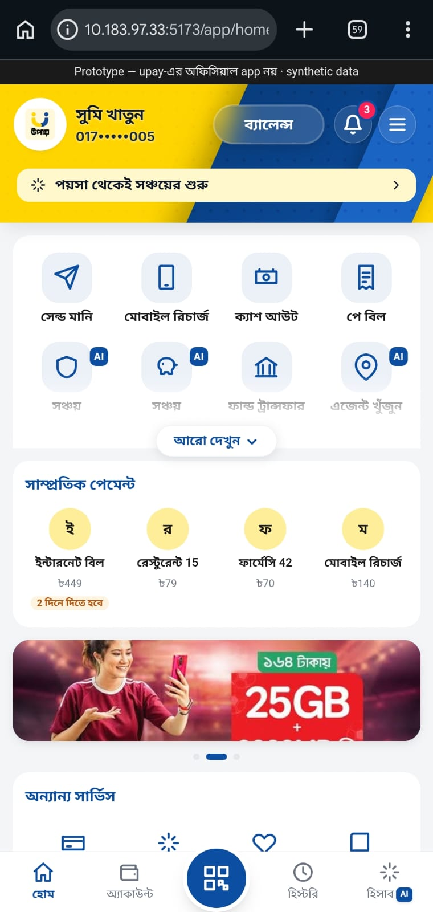
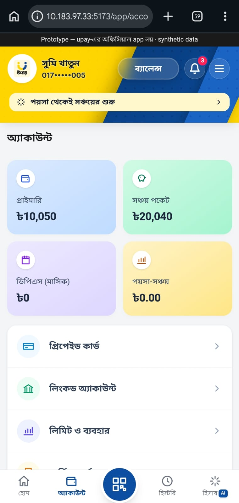
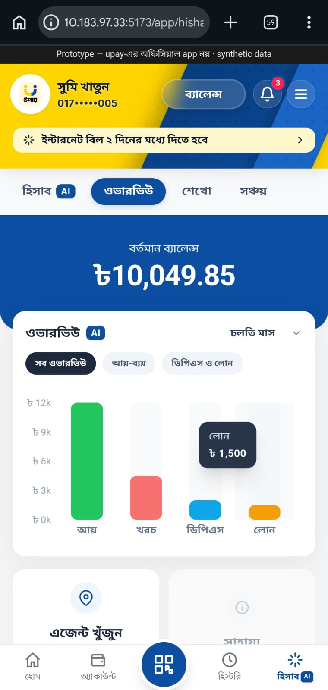
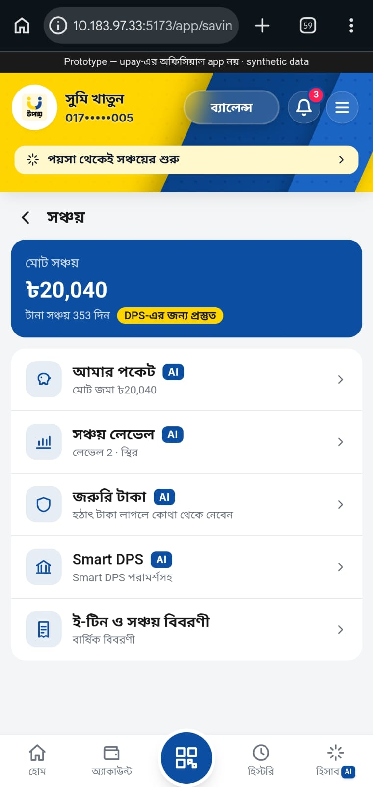

<div align="center">
  
  <br/>
  <h1>🚀 Hishab AI — An upay Cash-flow Copilot</h1>
  <p><b>Empowering Low-Income MFS Users with AI-Driven Financial Health (AI DEV FEST 2026 • Track 3)</b></p>

  [](https://reactjs.org/)
  [](https://fastapi.tiangolo.com/)
  [](https://tailwindcss.com/)
  [](https://python.org)
</div>

---

## 🎥 Watch the Demo Video
[](https://youtu.be/EUe-zCwZJgk?si=CNCy9P8Kg2qeqbGK)
*Click the image above to watch the full demonstration of Hishab AI.*

---

## 💡 The Vision (Track 3 Solution)
Developed by **Team RageBait** (Fahim Shahryar, Hasibul Hasib, Abu Nabil Md. Masrur).

Addressing the specific problem statement of **Track 3**, we present **Hishab AI**—an intelligent, voice-enabled financial copilot designed specifically for low-income Mobile Financial Service (MFS) users in Bangladesh. Built as a functional prototype for the **upay** ecosystem, this solution aims to bridge the gap between simple transactional wallets and proactive financial management for marginalized demographics.

## 📱 App Gallery
<div align="center">
  
  
  
</div>
<div align="center">
  
  
  
</div>

## ✨ Key Features
1. **📊 AI Cash-Flow Forecasting:** Integrates **LightGBM** and **Scikit-learn** to predict 30-day income/expense trends and alert users of potential liquidity shocks.
2. **📍 Smart Agent Locator:** Uses Geolocation to find nearby agents and calculates an AI-predicted **"Liquidity Score"** to ensure cash availability.
3. **🎙️ Inclusive Voice Assistant:** Features a fully native **Bangla Voice-to-Text copilot** powered by Claude AI, removing literacy barriers for rural users.
4. **🛡️ Responsible AI Readiness:** Acts purely as an explainable financial coach without making autonomous or biased lending decisions.

## 🛠️ Enterprise-Ready Technology Stack
* **Frontend:** React 19, TypeScript, Vite, Tailwind CSS v4 (Mobile-first layout), Recharts.
* **Backend:** Python 3.11, FastAPI (Microservice Architecture), Pydantic v2.
* **AI/ML Engine:** LightGBM, Pandas, NumPy (Forecasting) + Anthropic Claude API (Conversational NLP).

## 🚀 How to Run Locally

### 1. Backend Setup
```bash
cd backend
python -m venv .venv
source .venv/Scripts/activate  # (On Windows: .venv\Scripts\activate)
pip install -r requirements.txt
python -m uvicorn hishab.api.main:create_app --factory --host 0.0.0.0 --port 8000 --reload
```

### 2. Frontend Setup
```bash
cd web
npm install
npm run dev
```
Navigate to `http://localhost:5173` in your browser.

---
*Disclaimer: This is a hackathon prototype and not an official upay application. It uses exclusively synthetic data to comply with strict data privacy and Responsible AI policies.*
