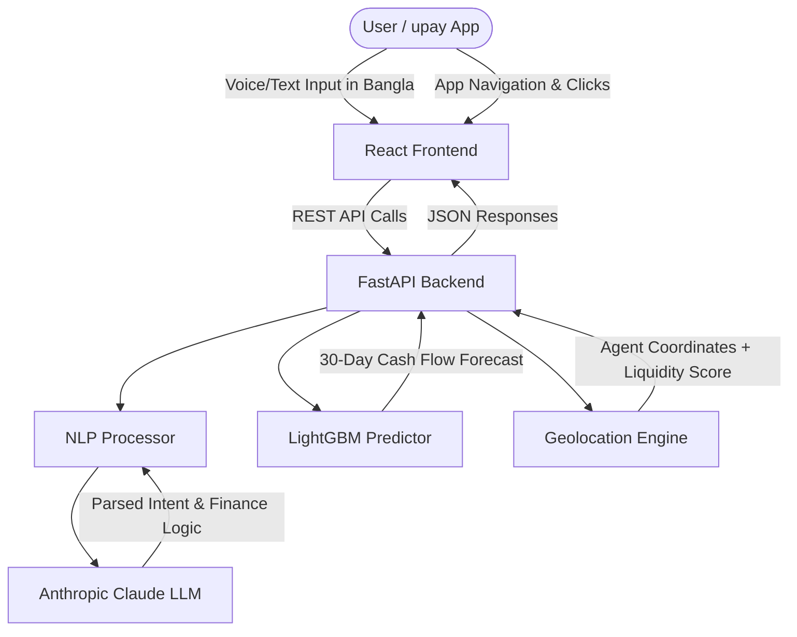

# 🧠 The Brain of Hishab AI: Architecture & Logic

Welcome to `brain.md`! This document explains the internal intelligence, machine learning architecture, and data flow of the **Hishab AI** copilot.

---

## 1. System Architecture Diagram

## 2. The Machine Learning Engine (Forecasting)
At the core of our predictive capabilities is a **LightGBM** model integrated via Scikit-learn pipelines.
* **Data Synthesis:** We generate synthetic transaction behaviors (Income, Expenses, DPS, Loans) to simulate a user's financial life over months.
* **Feature Engineering:** The model extracts rolling averages, spending spikes, and salary patterns from raw transactional history.
* **Prediction:** It outputs a 30-day liquidity forecast. If the forecasted balance approaches zero, the app proactively warns the user to adjust their spending.

## 3. The Natural Language Processor (LLM)
We integrated the **Anthropic Claude API** to act as the conversational brain of the app.
* **Prompt Engineering:** Claude is given a strict "System Prompt" to act as a friendly Bengali financial coach. It is forbidden from giving direct investment advice or promising loans.
* **Tool Calling (Function Calling):** The LLM is equipped with backend tools. For example, if a user asks "কোথায় ক্যাশ আউট করবো?" (Where can I cash out?), Claude triggers the `find_agents_near_me` tool, fetches the Geolocation JSON, and formats the response naturally.
* **Fallback Mechanisms:** If the LLM fails or hits a rate limit, the system falls back to regex-based intent matching to ensure the user always gets a response.

## 4. Smart Agent Liquidity Scoring
Instead of just plotting agents on a map, our backend calculates an **AI Liquidity Score**.
* **Logic:** Based on synthetic historical withdrawal volumes and time-of-day traffic, the system assigns a score (0.0 to 1.0) and a status (`High Cash`, `Medium Cash`, `Low Cash`) to nearby agents.
* **Impact:** Prevents rural users from wasting time and transport costs visiting empty agent points.

## 5. Security & Validation
* We utilize **Pydantic v2** for rigorous schema validation. Every API request and LLM tool output is strictly typed.
* PII (Personally Identifiable Information) stripping ensures that phone numbers or sensitive synthetic data are not leaked into the LLM context unnecessarily.
